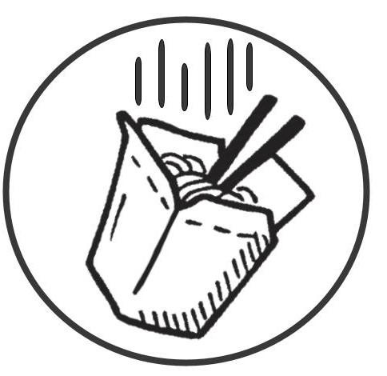
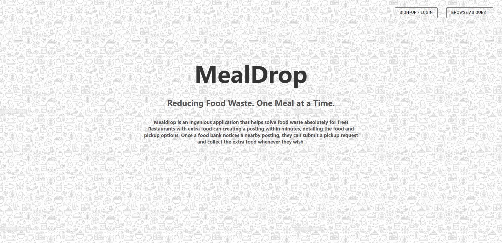
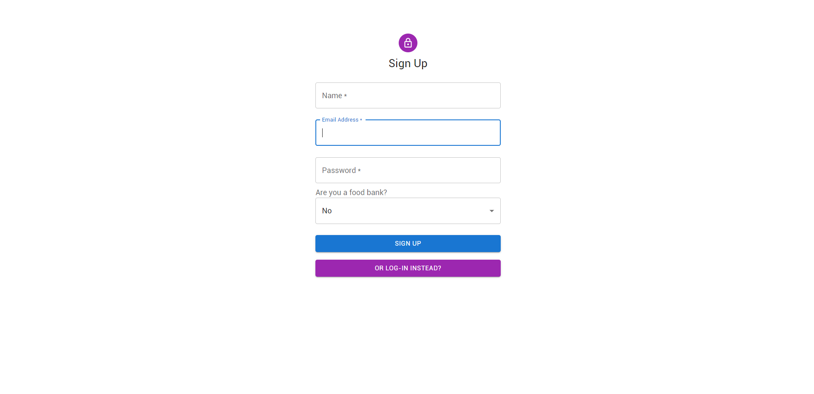
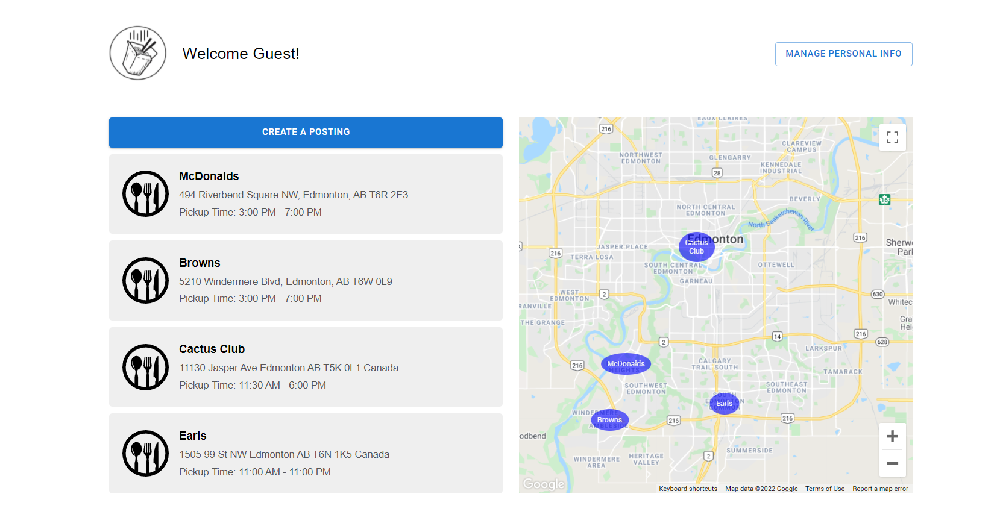
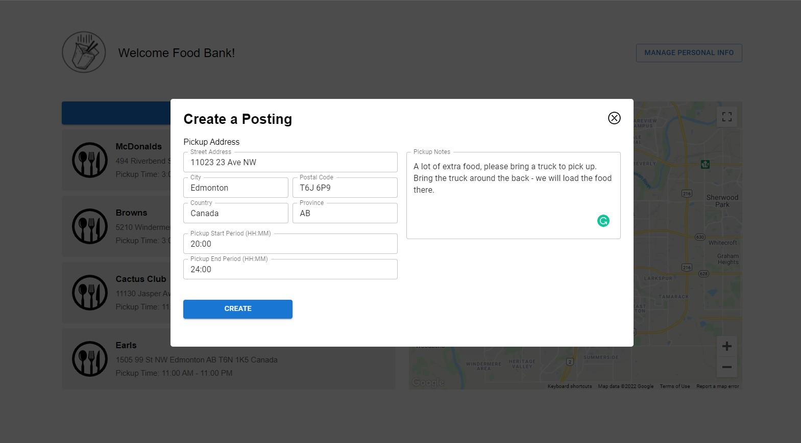
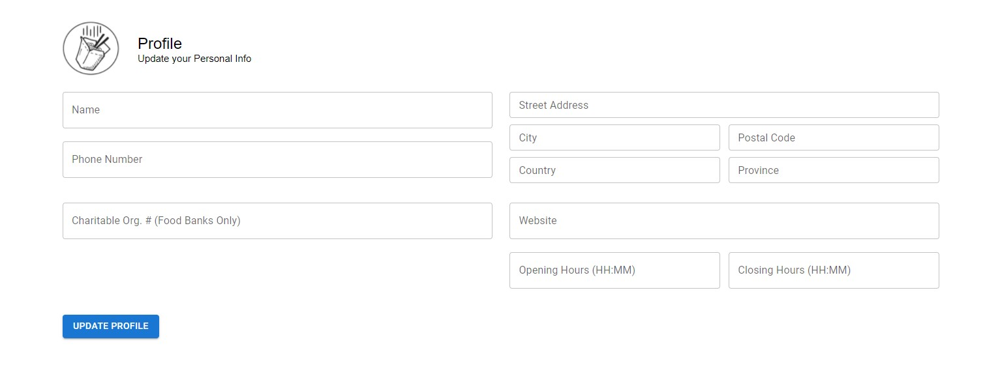
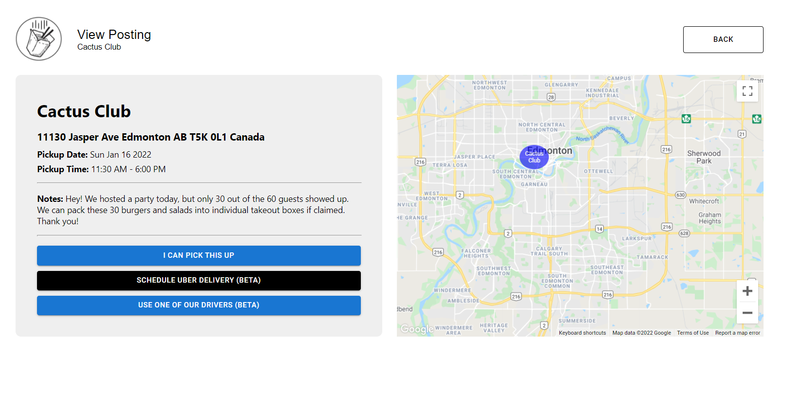
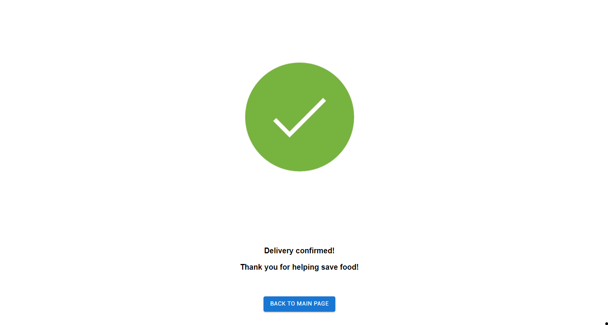

# Meal Drop

## Inspiration
Many of us who previously worked in a restaurant know all too well the problem of food waste. In the United States, food waste makes up around **30 to 40 percent** of the food supply. At the same time, **690 million people** go to bed on an **empty stomach worldwide.** **Mealdrop** aims to mitigate this problem. 

## What it does
**Mealdrop** is an ingenious application that helps solve food waste absolutely for free! Restaurants with extra food can create a posting within minutes, detailing the food and pickup options. Once a food bank notices a nearby posting, they can submit a pickup request and collect the extra food whenever they wish.

## How we built it
We created this app using the **MERN stack (MongoDB, Express, React.js, Node.js)**. Our **Heroku server** handles **RESTful HTTP requests** from the front-end app to manipulate the **Mongo database**. To ping these endpoints on the server we use **Axios, a promise-based HTTP client,** on the front-end. 

Our React front-end also handles authentication through **JWT (JSON Web Tokens)** and stores the user data serverlessly. Through this user data authentication, we can make sure that all server requests are legitimate; no outside user can manipulate another **MealDrop** user's data without their permission. We have also implemented **Google Cloud Platform's Javascript Maps** and their **GeoCode** library to display the locations of the participating restaurants on a map.

On the side of our back-end, we are hosting our server on **Heroku**. This way, we can ping our server endpoints without running our server locally. We created extremely robust yet flexible schemas for our database following the advanced principles of database creation. We handled routes in an elegant manner by making sure that the code was upscalable - to add any other routes, all that is required is to add another router file. 

We followed **clean code practices** in creating this in the hopes that one day we can turn this project into a reality.

## Challenges we ran into
Some challenges that we ran into were regarding the **JWT token authentication.** We wanted to make sure that the **cookies** allowed for **seamless UX** by introducing **refresh tokens**. These refresh tokens automatically **authenticate** the user for up to 200 days.

Some more challenges that we ran into were with GitHub at times. We **accidentally** deleted all of our code, and the only way we could get that code back was by CTRL+S'ing on the "deleted" on the files in our VSCode editors.

## Accomplishments that we're proud of
We are proud of being able to create this project within 24 hours. Considering that this app has 8 separate pages and we are only a group of 3, this project took us a solid amount of time. We made sure EVERYTHING worked and was hooked up (there is no dummy data anywhere :) ), and this strive for perfection made this app the beauty that it is right now.

## What we learned
We learned about JWT tokens, CORs policies, React development, Express development, Node.js development, and MongoDB schema design principles.

## What's next for Meal Drop
We plan on implementing our Beta features which are hooking up **MealDrop** with **Uber** delivery, and creating a **separate user account type** for volunteer drivers. 
