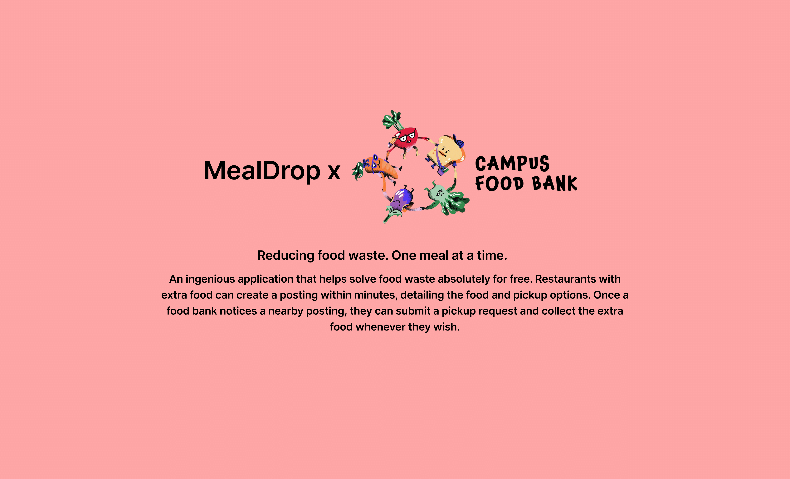

# Meal Drop

## Ready to make a difference? 
Want to assist the campus with feeding students? Contact matthiaswang1667@gmail.com to set-up a partnership with the UAlberta Food Bank. Visit the website for more information https://campusfoodbank.com/

## Inspiration
After creating Pento Bento, which placed top 3 in HackCamp 2021, I wanted to independently deploy my own version of the project to production. Many of us who previously worked in a restaurant know all too well the problem of food waste. In the United States, food waste makes up around **30 to 40 percent** of the food supply. At the same time, **690 million people** go to bed on an **empty stomach worldwide.** **Mealdrop** aims to mitigate this problem. 

## What it does
**Mealdrop** is an ingenious application that helps solve food waste absolutely for free! Restaurants with extra food can create a posting within minutes, detailing the food and pickup options. Once a food bank notices a nearby posting, they can submit a pickup request and collect the extra food whenever they wish.

## How was it built?
App was created using the **MERN stack (MongoDB, Express, React.js, Node.js)**. the **Heroku server** handles **RESTful HTTP requests** from the front-end app to manipulate the **Mongo database**. To ping these endpoints on the server we use **Axios, a promise-based HTTP client,** on the front-end. 

React front-end also handles authentication through **JWT (JSON Web Tokens)** and stores the user data serverlessly. Through this user data authentication, I ensured that all server requests are legitimate; no outside user can manipulate another **MealDrop** user's data without their permission. I have also implemented **Google Cloud Platform's Javascript Maps** and their **GeoCode** library to display the locations of the participating restaurants on a map.

Servers are hosted on **Heroku**. This way, we can ping the server endpoints without running the server locally. I created extremely robust yet flexible schemas for the database following the advanced principles of database creation. I handled routes in an elegant manner by making sure that the code was upscalable - to add any other routes, all that is required is to add another router file. 

Followed **clean code practices** in creating this in the hopes that one day this project can be scaled even larger.

## Challenges
Some challenges that I ran into were regarding the **JWT token authentication.** I wanted to make sure that the **cookies** allowed for **seamless UX** by introducing **refresh tokens**. These refresh tokens automatically **authenticate** the user for up to 200 days.

## What's next for Meal Drop?
I plan on implementing the Beta features which are hooking up **MealDrop** with **Uber** delivery, and creating a **separate user account type** for volunteer drivers. 
